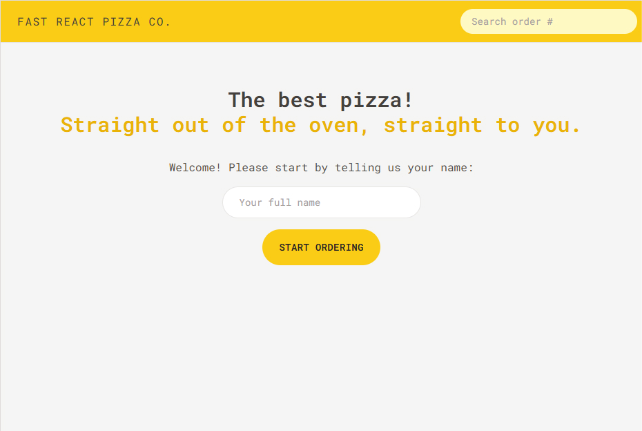
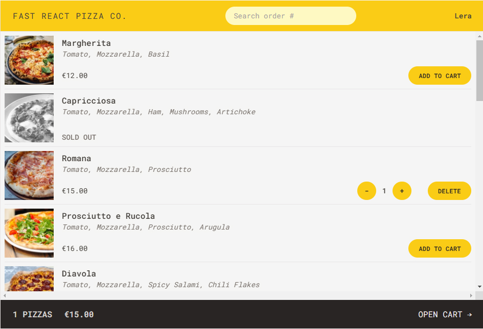
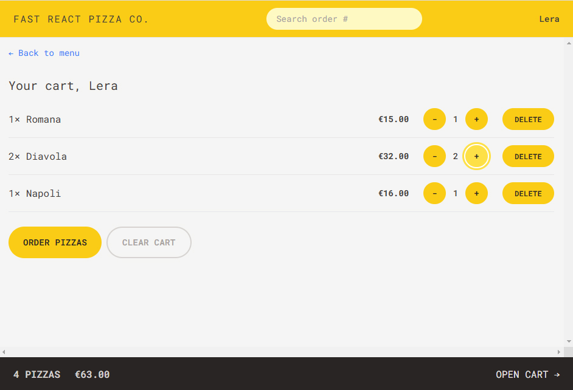
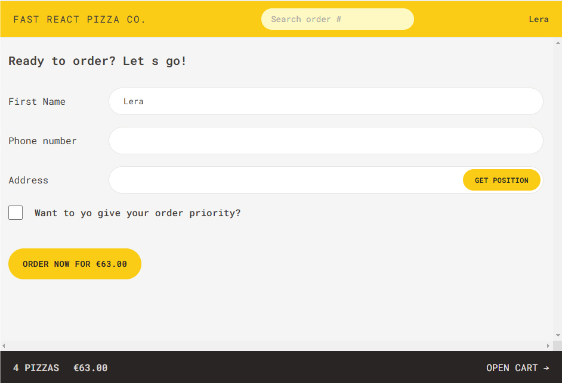
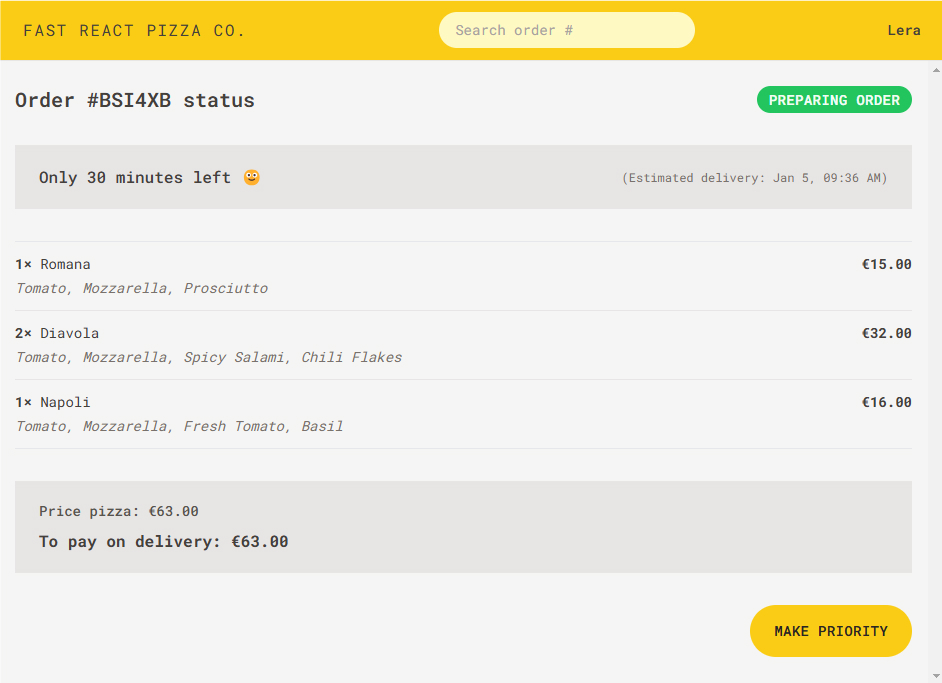

# Fast React Pizza
*using techs: React, React Router, Redux Toolkit, Tailwind CSS*

- Very simple application, where users can order one or more pizzas from a menu
- Requires no user accounts and no login: users just input their names before using the app (display username is diff pages)
- The pizza menu can change,so it should be loaded from an API ("https://react-fast-pizza-api.onrender.com/api/menu")
- Users can add multiple pizzas to a cart before ordering
- Ordering requires just the user's name, phone number, and address
- Users can mark their order as "priority" for an additional 20% of the cart price
- Orders are made by sending a POST request with the order data to the API (user data + cart data with selelcted pizzas) ("https://react-fast-pizza-api.onrender.com/api/order")
- GPS location is provided, to make delivery easier
- Payments are made on delivery, so no payment processing is necessary in the app
- Each order will get a unique ID that should be displayed, so the user can later look up their order based on the ID
- Users should be able to mark their order as "priority" order even after it has been placed

API for getting GPS location of user: "https://api.bigdatacloud.net/data/reverse-geocode-client?latitude=${latitude}&longitude=${longitude}"

Test orderID: IIDSAT (search input)

Main page:

Menu page:

Shopping Cart page:

Create order form:

Order page (with active button to make Priority)

