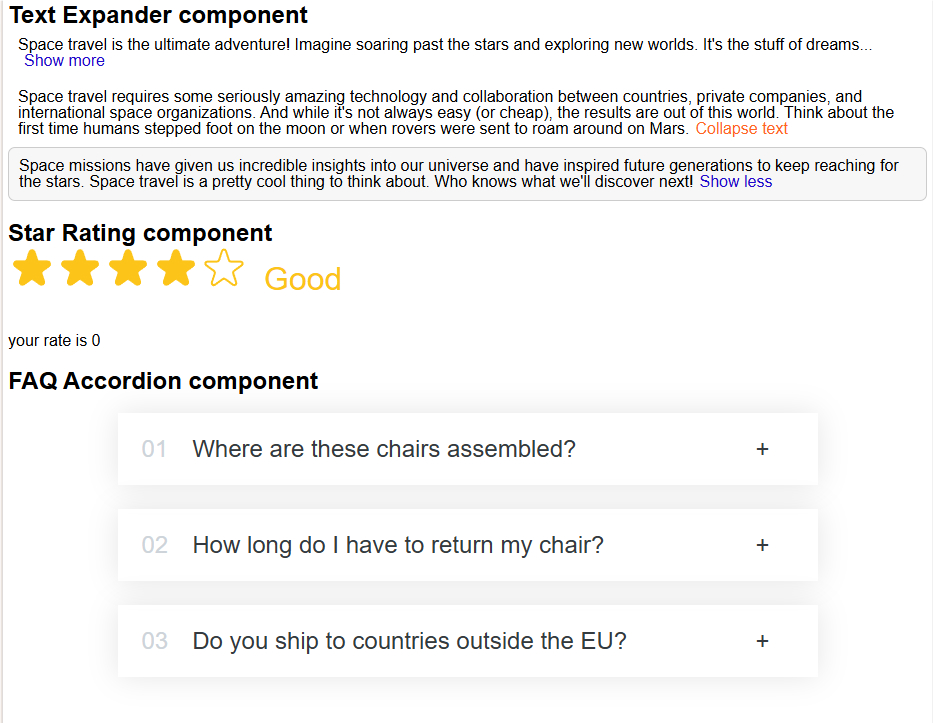
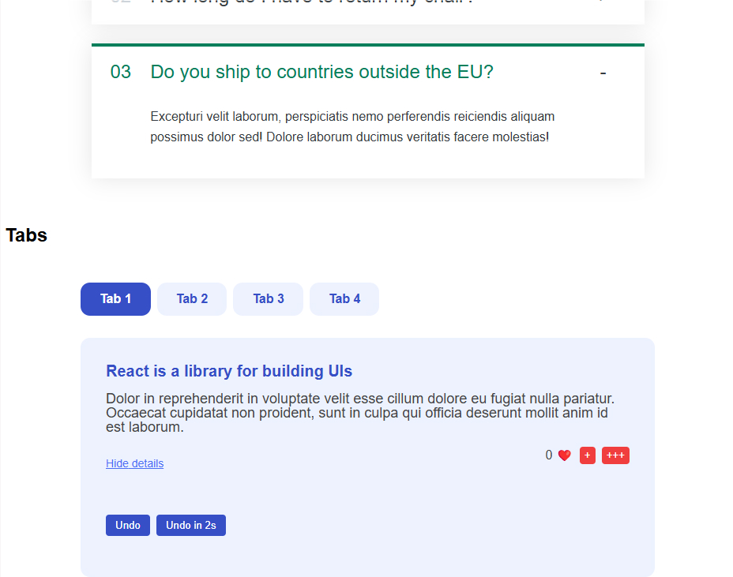
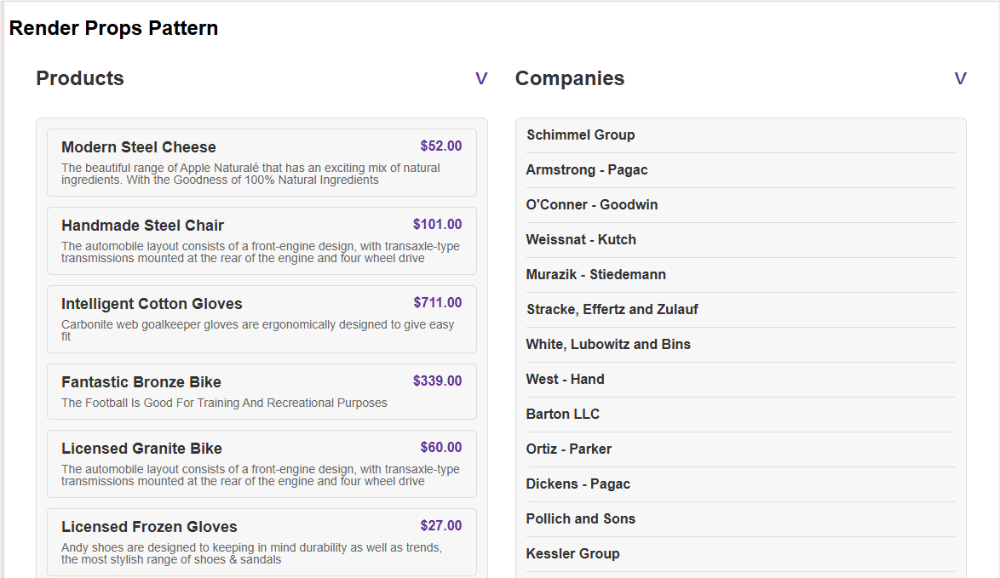
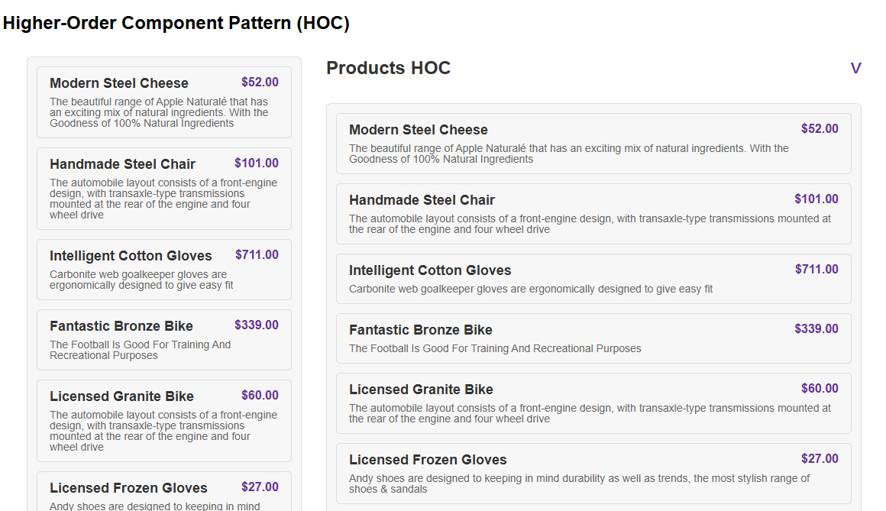
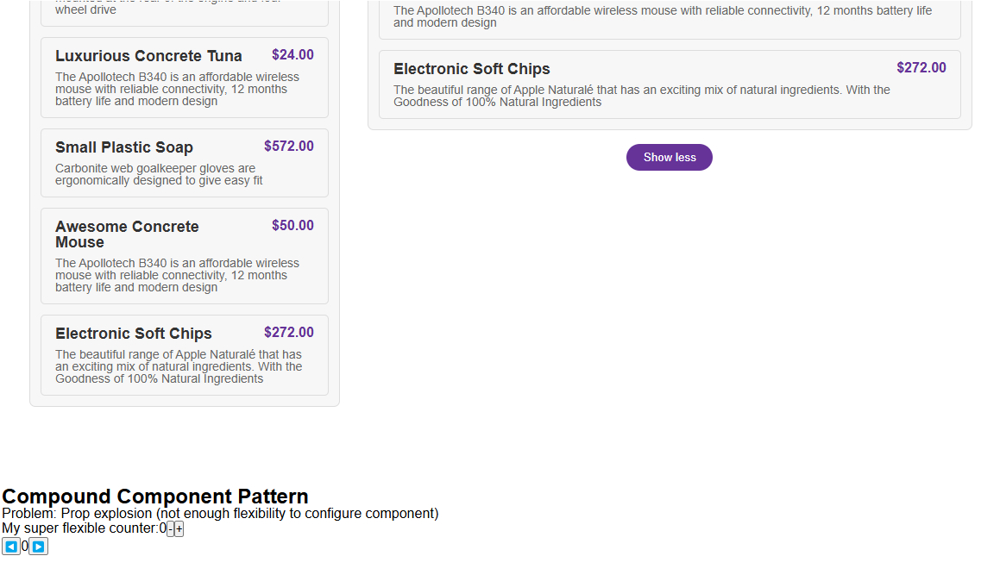

# Mix of re-usable Components

1. **TextExpander** (with buttons "Show more...", "Show less...", )
2. **Star Rating** (onHover: show a rating description on this position; onClick: change the rating value)
3. **Accordion** for FAQ section
4. **Tabbed** (on each tab page, save the unique state)
5. **Render Props pattern** reusable component for different list of items (ex. Products, Companies) - using @facker-js Api for generating list of products and companies
6. **HOC - Higher Order Component pattern** takes another component and returns a new enhanced version of the component (with additional features)
7. **Compound Component pattern**  for very self-contained components that need to manage their own state (super fancy component - very flexible) - resolve "Props Explosion" problem

