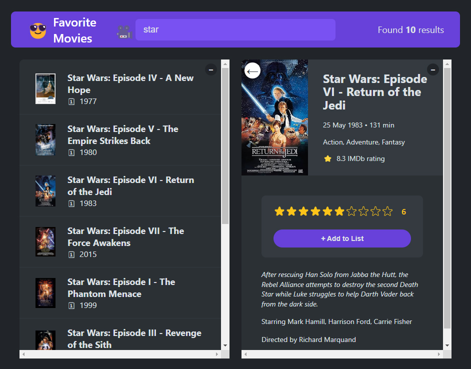
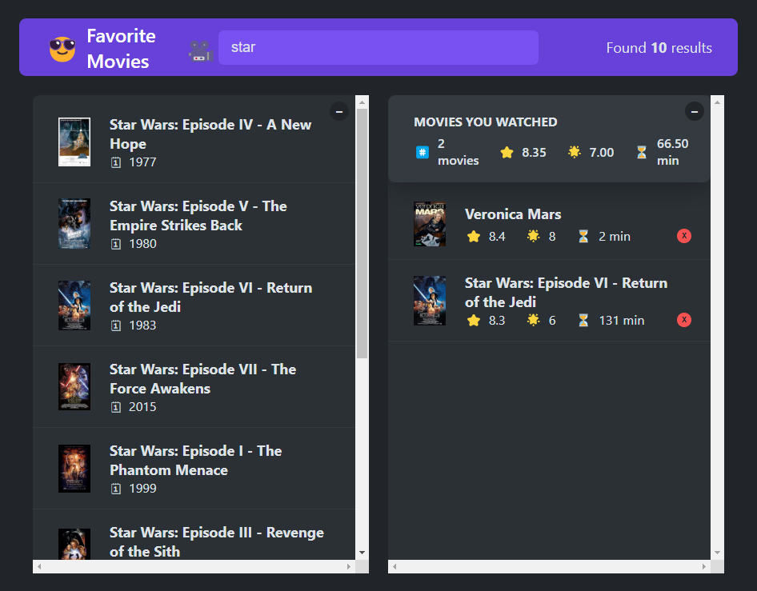

# Movies project

*using API for fetching movies: [omdbapi.com](https://omdbapi.com)*
*using techs: React, LocalStorage - state*

Functionality:
- Search movies (start searching from 3rd character - for optimization purpose)
- Select movie and show details about it (right side)
- User can set Rating for movie and after Add it to his favorite List 
- User can watch his favorite movies List on the right side of the page (Back button)
- User can delete movies from his List

