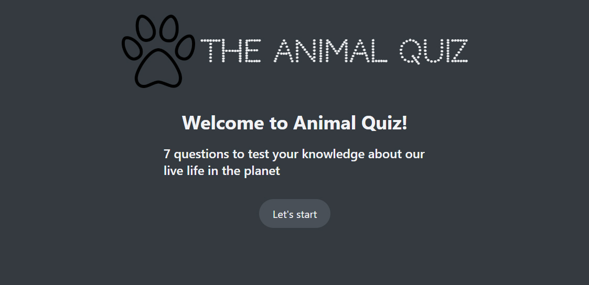
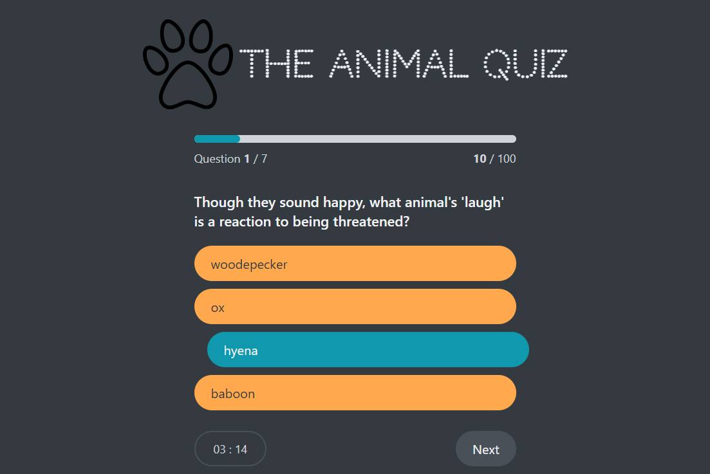
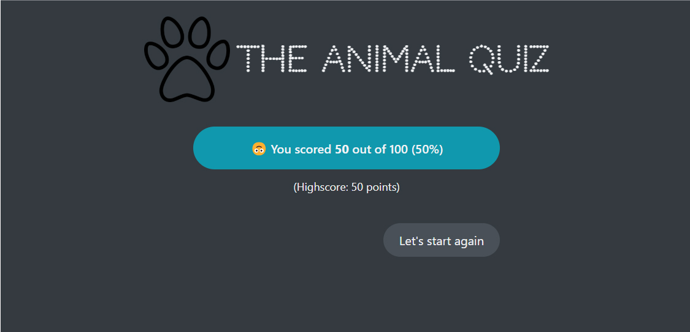

# Quiz App
*Using techs: React, Context API, Reducer*

Run Server (read from data/questions.json)

- Fetch questions and answers data for Quiz
- User select answer from the list for exact question, after choosing see if the answer is correct (correct answer will empasise with blue color)
- Limit time of passing the test
- During the Quiz show Progress Bar: how user is passing the test: current question/Total number of questions, percent of correct answers
- At the end show the result page with the score
- Save highest score for user

