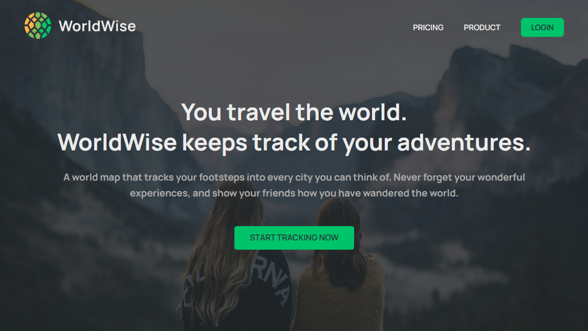
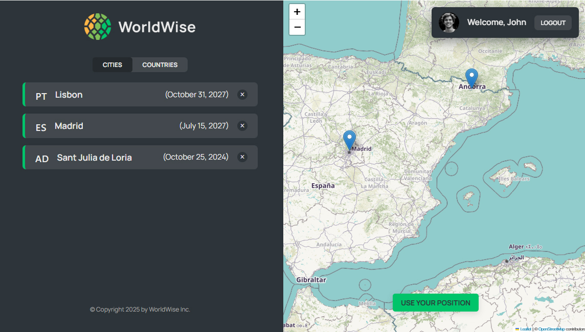
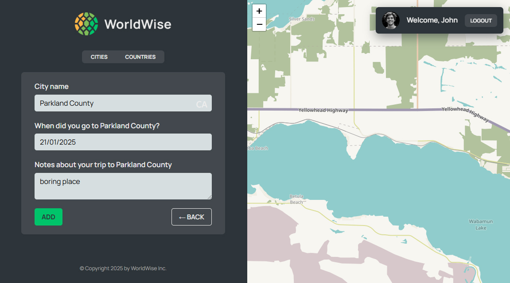

# WorldWise app - tracker of your travel experience

*using techs: React + Vite*
*libs:*
*- leaflet, react-leaflet - Map library*
*- react-datepicker - inputbox: dropbox calendar*
*Server (fake API): json-file 'data/cities.json'*

App that allow user to save cities and countries which user visited with comments about this place.

feature: Easy navigation by clicking on map and saving location

Login Page with fake user: "user@example.com" (password: "qwerty")

